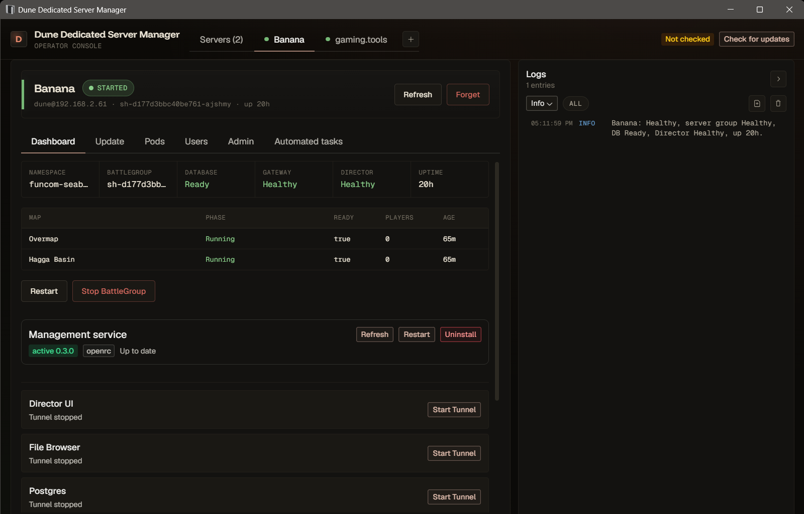
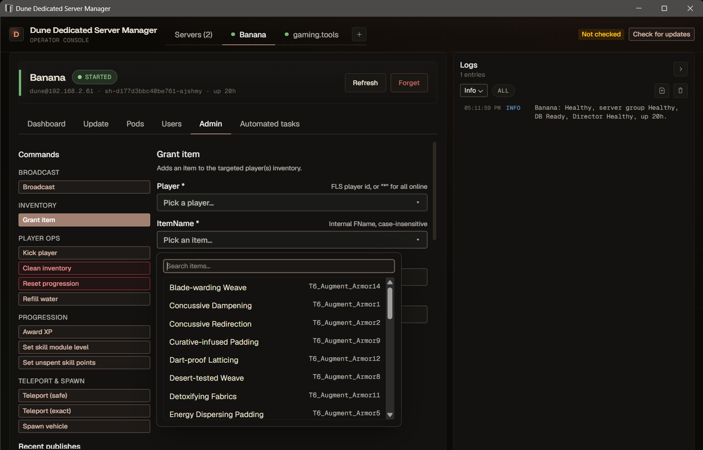

# Sietch — Dune Dedicated Server Manager

A desktop manager for existing Dune: Awakening dedicated servers.

> **Unofficial community fork.** Sietch is a fork of
> [adainrivers/dune-dedicated-server-manager](https://github.com/adainrivers/dune-dedicated-server-manager)
> (© gaming.tools, MIT-licensed). It adds an integrated UI redesign, Hyper-V VM
> power controls, in-game currency / Tech-Knowledge grants, a host health &
> hardening advisor, and assorted reliability fixes — several of which are also
> contributed back upstream. **Not affiliated with, endorsed by, or sponsored by
> gaming.tools, Funcom, or Legendary Entertainment.** "Dune" and related names
> are trademarks of their respective owners; this is a fan-made server-admin tool.

The app manages already-provisioned Dune: Awakening dedicated servers over SSH
and Kubernetes control commands. It does not install the game server, create
VMs, configure Hyper-V, provision Ubuntu, or manage external tools such as
SteamCMD.

## What Sietch adds (over upstream)

- **Integrated UI redesign** — a denser, dark "desert ops" dashboard, admin console, and management panels.
- **Hyper-V VM power controls** — start/stop the server VM from the app when it runs on the Hyper-V host, with auto-detection of the local Funcom VM + SSH key.
- **In-game grants** — Solari, House Scrip (currency), and Intel / Tech Knowledge, as guarded offline database writes (player must be offline).
- **Host Health & Hardening advisor** — SSH-probes the VM for swap / memory / disk / DB-restart / OOMKilled-pod issues and offers one-click fixes (add a swapfile, tune swappiness).
- **Reliability fixes** — also contributed back upstream: `battlegroup update` false-failure exit code, the Auto-Update toggle not staying off + Users-tab freeze, and clearer backup-failure diagnostics. Plus restart-aware backoff for the welcome scan.

## Features (inherited base)

- Remote server profile management with SSH private-key authentication
- BattleGroup status, start, stop, restart, and update controls
- Component diagnostics, log viewing, and safe restart actions
- Secure Director, File Browser, PostgreSQL, and PgHero access through local SSH tunnels
- Bundled `dune-server-service` daemon for on-host scheduled maintenance (daily restarts with in-game warnings, automated backups, server update check + apply) — installed over SSH straight from the Management card
- Admin console for in-game actions: item grants, vehicle spawns, skill/journey/XP tags, player lookup with live pawn location, and a logged history of every published command
- Automated tasks tab with editable schedule settings (daily restart time, warning lead/frequency, update apply lead, IANA timezone) — saving auto-restarts the service so changes apply immediately
- Welcome Package automation: a per-player onboarding chain (item grants, water refill, welcome whisper) driven by Postgres player detection, tracked in the management service's SQLite ledger, and configurable from the Welcome Package tab with both a visual editor and a raw JSON mode

More management features coming soon.

## Install

Download the latest release for your operating system from
[this repository's Releases](https://github.com/thebadwolf79/sietch-dune-server-manager/releases).

- Windows: run the NSIS installer.
- Linux: use the AppImage or Debian package.
- macOS: use the DMG for your Mac architecture.

After launching the app, add an existing server profile with its host, SSH user,
and private key path, then refresh it to detect BattleGroups and management
endpoints.

## Managed Server Assumptions

The target server must already be installed and reachable over SSH. The app
expects the Dune Kubernetes resources and vendor management scripts to exist on
the server before you add it.

Required player-facing/server ports depend on your own server deployment. A
typical dedicated-server deployment uses:

- UDP 7777-7810 for game servers
- TCP 31982 for RMQ

## Issues & feedback

Found a bug in **Sietch** or have a request? Open an issue here:
<https://github.com/thebadwolf79/sietch-dune-server-manager/issues>

If the problem is with the upstream project rather than this fork's additions,
consider reporting it at
[adainrivers/dune-dedicated-server-manager](https://github.com/adainrivers/dune-dedicated-server-manager/issues)
so the whole community benefits.

## Building From Source

See [Building From Source](docs/building-from-source.md).

## Credits & relationship to upstream

Sietch is built on
[adainrivers/dune-dedicated-server-manager](https://github.com/adainrivers/dune-dedicated-server-manager)
by **gaming.tools** (creators of the Dune Awakening Database) — full credit for
the foundation goes to them. This fork tracks upstream and contributes broadly
useful fixes back rather than hoarding them. It is an independent, unofficial
fork, **not affiliated with or endorsed by gaming.tools, Funcom, or Legendary
Entertainment**. "Dune" and related names are trademarks of their respective
owners.

## License

MIT License — see [LICENSE](LICENSE). Original work © gaming.tools; fork
modifications © TheBadWolf79. Both retained per the MIT terms.
